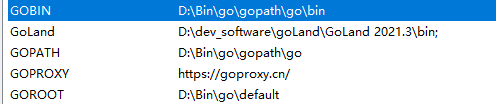

# hero_story.go_server
### 配置 go 环境 

```text
GOBIN 
GOPATH
GOROOT
```
### 安装 protobuf 插件   安装成功会  D:\Bin\go\gopath\go\bin 下的   多一个 protoc-gen-go.exe 
```shell
go get google.golang.org/protobuf
```
###  生成文件 
```shell
protoc --go_out=. .\GameMsgProtocol.proto 
```
此时报错 我们需要将 D:\Bin\go\gopath\go\bin 下的  protoc-gen-go.exe 
C:\Windows\System32 下 